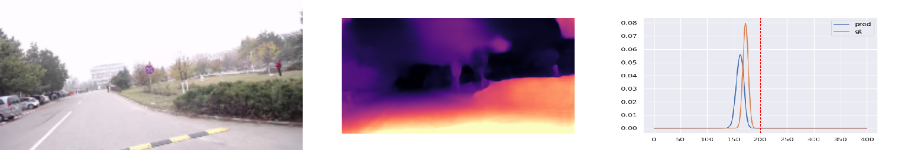
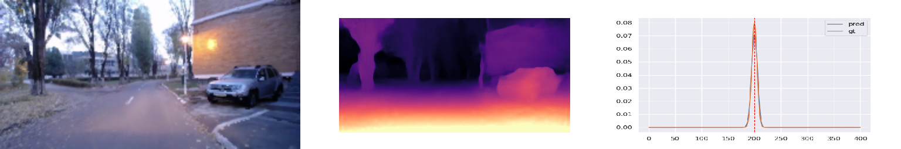

# Steering-Network-2

<p align='center'>
  
</p>

<p align='center'
  
</p>

## Pre-requisits
```shell
mkdir -p pipeline/models/monodepth
cd pipeline/models/monodepth
```
For monodepth, download the pre-trained models from <a href='https://drive.google.com/drive/folders/18kTR4PaRlQIeEFJ2gNkiXYnFcTfyrRNH?usp=sharing'>here</a>

```shell
mkdir -p pipeline/models/inpaint
cd pipeline/models/inpaint
```
For the inpaint, download the pre-trained model from <a href='https://drive.google.com/drive/folders/1oeVxVnR5BIZ1QM-ClY6Xa4CogxTQzmZx?usp=sharing'>here</a>

```shell
mkdir -p pipeline/models/flow
cd pipeline/models/flow
```
For optical flow, download the pre-trained model from <a href='https://drive.google.com/drive/folders/1sahN3m6salz64fG8XFGuA0vYklkWYMNu?usp=sharing'>here</a>


## Create dataset

```shell
mkdir raw_dataset
```

* Download the UBP dataset into the "raw_dataset" directory. A sample of the UPB dataset is available <a href="https://drive.google.com/drive/folders/1p_2-_Xo-Wd9MCnkYqPfGyKs2BnbeApqn?usp=sharing">here</a>.

```shell
mkdir scene_splits
```

* Download the scene splits into the "scene_splits" directory. The train-validation split is available <a href="https://github.com/RobertSamoilescu/UPB-Dataset-Split">here</a>.
In the "scene_splits" directory you should have: "train_scenes.txt" and "test_scenes.txt".

## Train models
```shell
./run_train.sh
```

## Test models - Open-loop evaluation
```shell
./run_test.sh
```

## Results - Open-loop evaluation
